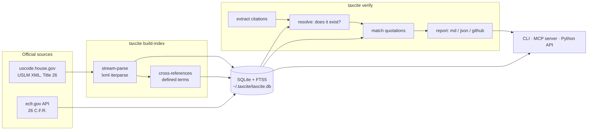

# TaxCite — verify, navigate and compute U.S. federal tax law

**Check what a draft cites, find what governs a question, and compute what follows —
with every answer traced to published government authority.**

[](https://github.com/rakib-nyc/taxcite/actions/workflows/ci.yml)
[](LICENSE)
[](https://www.python.org/downloads/)
[](https://modelcontextprotocol.io/)
[](tests/)
[](https://rakib-nyc.github.io/taxcite/)

**[Website](https://rakib-nyc.github.io/taxcite/)** ·
**[Technical overview](docs/technical-overview.md)** ·
**[Privacy](docs/privacy.md)** ·
**[Citation grammar](docs/citation-grammar.md)**

TaxCite is a [Model Context Protocol](https://modelcontextprotocol.io/) (MCP) server
and a command-line tool for U.S. federal tax work. It reads the **Internal Revenue
Code**, **Treasury Regulations**, IRS guidance from the **Internal Revenue Bulletin**
and federal **case law**, and does three things with them:

| | | |
|---|---|---|
| **Verify** | Is this citation real? Is this quotation verbatim? Does this authority count? | `verify` `check_case` `authority` |
| **Navigate** | What must I read to understand this? What do its terms of art mean? | `reading-list` `closure` `define` `xrefs` |
| **Compute** | What does the law say this number is, and where does that number come from? | `model-382` `owner-shift` `carryover` |

It exists because large language models are fluent in the *register* of tax law and
unreliable about its *content*, and because the same is true of anyone working fast
from memory. Every answer names the provision that authorises it — and says plainly
what it could not check.

> ### ⚠️ Experimental research software — read this first
>
> **TaxCite is an experimental research tool. It is not tax advice, not legal advice,
> and not a substitute for professional judgment or a commercial tax service.**
>
> It verifies that cited provisions **exist**, that quoted language **matches** the
> official source, and computes figures from **rules you supply facts to**. It does
> **not** judge whether a legal conclusion is correct, whether an authority is on
> point, whether a decision is still good law, or whether a transaction qualifies for
> any treatment.
>
> **No warranty.** This software is provided "AS IS", without warranty or condition of
> any kind, express or implied, and without any guarantee of accuracy, completeness,
> currency, or fitness for a particular purpose. See the
> [Apache License 2.0](LICENSE), sections 7 and 8. **You are responsible for
> independently verifying every authority and every figure you rely on.** Do not file,
> serve, or submit work on the strength of this tool alone.

## Why

Language models are fluent in the *register* of tax law and unreliable about its
*content*. They cite § 162(z), which does not exist. They quote § 162(a) and attribute
it to § 162(b). They produce sentences that sound exactly like the Code and appear
nowhere in it. Those three failures look identical on the page and need completely
different fixes, so TaxCite reports them as three different things.

```
$ taxcite verify draft.md
| # | Citation        | Line | Status                          | Note                                                    |
|---|-----------------|-----:|---------------------------------|---------------------------------------------------------|
| 1 | I.R.C. § 162(a) |   15 | ok: verified, quote_exact       | I.R.C. § 162(a) exists                                  |
| 2 | I.R.C. § 162(z) |   46 | ERROR: pinpoint_not_found       | § 162 has subsections (a)–(s); no (z)                   |
| 3 | I.R.C. § 263(a) |   49 | ERROR: verified, quote_misattributed | the quoted language appears at I.R.C. § 61(a)      |
```

## Quickstart

```bash
uv sync --all-extras
uv run taxcite build-index                     # ~10 s, downloads 8 MB from uscode.house.gov
uv run taxcite verify examples/sample_memo.md  # see the planted errors caught
uv run taxcite serve                           # run the MCP server
```

## Use it from an AI client

TaxCite speaks MCP over stdio.

**Claude Code**

```bash
claude mcp add taxcite -- uv --directory /path/to/taxcite run taxcite serve
```

**Claude Desktop** — add this to `claude_desktop_config.json`
(`~/Library/Application Support/Claude/` on macOS,
`%APPDATA%\Claude\` on Windows); a copy is in
[`examples/claude_desktop_config.json`](examples/claude_desktop_config.json):

```json
{
  "mcpServers": {
    "taxcite": {
      "command": "uv",
      "args": ["--directory", "/absolute/path/to/taxcite", "run", "taxcite", "serve"]
    }
  }
}
```

**Cursor and other MCP clients** take the same command and arguments.

Build the index once (`uv run taxcite build-index`) before starting the server;
otherwise every tool answers "Index not built. Run: taxcite build-index".

To check an installation end to end — the process starts, the transport works, the
tools are registered and answer correctly — run
[`scripts/smoke_test_mcp.py`](scripts/smoke_test_mcp.py):

```bash
uv run python scripts/smoke_test_mcp.py
```

### Tools the server exposes

| Tool | What it does |
|---|---|
| `get_irc_provision` | The official text of a Code provision, at any depth |
| `get_treasury_reg` | The same, for a Treasury Regulation, fetched on demand |
| `check_authority` | Classify a draft's citations under Treas. Reg. § 1.6662-4 |
| `compare_versions` | How a provision changed between two dates |
| `search_tax_law` | Full-text search across the Code and the regulations |
| `resolve_citation` | Parse a citation and say whether it exists |
| `check_case` | Look up a decision, and check a passage before quoting it |
| `reading_list` | What to read for a provision, and what its terms of art mean |
| `model_section_382` | Compute an I.R.C. § 382 limitation, citing every input |
| `test_ownership_change` | Test a shareholder register under I.R.C. § 382(g) |
| `attribute_carryover` | The I.R.C. § 381(c) attributes, and what limits them |
| `verify_citations` | Check a whole draft and return a report |
| `get_cross_references` | What a provision cites, and what cites it |
| `find_definition` | Where a term is defined, and what scope the definition has |
| `list_subdivisions` | A provision's children, for navigating before fetching |

There are also `taxcite://irc/{section}` and `taxcite://reg/{section}` resources, and a
`grounded_tax_memo` prompt that tells a model to read the law before describing it,
quote only what the tools returned, cite with pinpoints, and verify its own draft
before finishing.

## Use it in CI

```yaml
- uses: rakib-nyc/taxcite@v0.1.0
  with:
    files: "memos/**/*.md"
    fail-on: error
```

Findings appear as inline annotations on the pull request and as a job summary. A full
workflow is in [`examples/github-workflow.yml`](examples/github-workflow.yml).

## The command line

```
taxcite build-index [--irc/--no-irc] [--regs 1,31,301] [--irb 2023-2026]
               [--as-of YYYY-MM-DD] [--force]
taxcite info
taxcite versions [--refresh]
taxcite lookup "§ 162(a)" [--children] [--as-of YYYY-MM-DD] [--json]
taxcite search "ordinary and necessary" [--source irc|reg|all] [--as-of YYYY-MM-DD]
taxcite verify FILE... [--format md|json|github] [--offline] [--as-of YYYY-MM-DD]
               [--tax-year 2022] [--fail-on error|warning|never]
taxcite authority FILE... [--tax-year 2022] [--json]
taxcite diff "§ 163(j)" --from 2017-06-30 [--to YYYY-MM-DD]
taxcite xrefs "§ 1411" [--direction outgoing|incoming|both]
taxcite closure "§ 163(j)" [--depth 2] [--limit 25]
taxcite define "gross income" [--at "§ 162(a)"]
taxcite reading-list "Treas. Reg. § 1.1502-21(c)" [--depth 2] [--tax-year 2026]
taxcite model-382 --value 50000000 --change-date 2026-09-15 [--nol N] [--years N]
               [--income A,B,C] [--rbig N] [--short-year-days N] [--no-continuity]
taxcite owner-shift register.csv [--json]
taxcite carryover
taxcite serve
taxcite version
```

`verify` exits 0 when nothing reaches the `--fail-on` threshold, 1 when something does,
and 2 on a usage or runtime error.

### Two more that pay for themselves

**`closure`** answers "what do I have to have read before this sentence means
anything". Tax provisions are a graph; this walks it outward, nearest first.

```bash
taxcite closure "§ 163(j)" --depth 1
```

**`taxcite lookup`** shows a temporary regulation's sunset. § 7805(e) expires one three
years after issuance, and the issuance date is in the source credit at the foot of the
section — so citing an expired temporary regulation is a real and catchable error.
Regulations issued before § 7805(e) took effect in November 1988 are reported as
outside it rather than as expired.

**`define --at`** catches a mistake competent people make: borrowing a definition from
a section that does not govern yours.

```
$ taxcite define "trade or business" --at "§ 162(a)"
I.R.C. § 7701(a)(26) (scope: this title)
  The term "trade or business" includes the performance of the functions of a
  public office.

does not govern: I.R.C. § 513(c) defines "trade or business" for purposes of this
section, which does not reach I.R.C. § 162(a)
does not govern: I.R.C. § 163(j)(7)(A) defines "trade or business" for purposes of
this subsection, which does not reach I.R.C. § 162(a)
```

## Privacy, and the diligence record

**Your document never leaves your machine.** Verification is local, against a local
index. The only thing ever derived from your draft that touches the network is the
*section number* of a Treasury Regulation that has not been downloaded yet — and
`--offline` prevents even that, by sealing the process so no code path can make a
request for the rest of the run. [`docs/privacy.md`](docs/privacy.md) has the details,
including why I.R.C. § 7216 makes this more than a preference.

IRS OPR Alert 2026-19 applies Circular 230 § 10.22 to AI-assisted work: a practitioner
must review every AI-generated document, *including its citations*, before it goes out.
`--record` writes that review down for the engagement file:

```bash
taxcite verify memo.md --tax-year 2022 --offline --record diligence.jsonl
```

Each entry names what was checked, against which published sources, when, with which
version of the tool, and what was found — identifying the document by **SHA-256 hash
rather than by content**, so the record does not become another copy of privileged
text. It also states plainly what it does *not* establish: that the analysis is right.

## What a report looks like

See [`examples/sample_report.md`](examples/sample_report.md), the real output for
[`examples/sample_memo.md`](examples/sample_memo.md) — a memo with deliberately planted
errors. Every planted error is caught, and none of the valid citations is flagged.

## Court decisions

Case citations used to come back unverifiable whether they were real or invented. The
Free Law Project's CourtListener publishes a keyless, open API over several million
opinions, so now:

```
| 1 | Welch v. Helvering, 290 U.S. 111 (1933) | ok: verified | Supreme Court of the
                                                United States |
| 2 | Smith v. Jones, 999 U.S. 999 (2020)     | ERROR: not_found | no decision is
                                                reported at 999 U.S. 999 |
| 3 | Welch v. Helvering, 480 U.S. 23 (1987)  | ERROR: not_found | 480 U.S. 23 is
                                                Commissioner v. Groetzinger, not Welch
                                                v. Helvering |
```

The third row is the interesting one. A real reporter citation carrying the wrong case
name is a distinct failure mode — the benchmark literature counts it separately — and
it is invisible to anyone who checks only that the citation resolves.

### Quotations from a decision

A real case carrying an invented quotation is the failure that actually shows up in
AI-drafted work, and it survives any check that only asks whether the citation
resolves. The keyless API serves metadata, not opinion text — but it will answer a
narrower question: *does this run of words occur in this specific decision?* That is a
real verification, and a binary search over the opening words of a failing quotation
finds where it stops matching:

```
- Quote: "the standard set up by the statute is not a rule of law; it is rather a
   way of life."
- Quote status: quote_exact
   every word of this passage occurs in the decision, in order; punctuation and
   capitalisation were not compared, because the opinion text is not held locally

- Quote: "the standard set up by the statute is not a rule of law; it is rather a
   submarine protocol."
- Quote status: quote_close
   the first 17 words of this passage occur in the decision; it stops matching at
   "submarine protocol."

- Quote: "quarterly submarine inspection protocols govern the deduction of
   periscope costs."
- Quote status: quote_not_found
   no run of words from this passage occurs in the decision
```

Three quotations from the same real case, and three different answers: verbatim,
misquoted from word 18, and invented. Those call for three different corrections, and
telling them apart is the point.

Two limits, both stated in the report rather than left to be discovered. A phrase
search normalises punctuation and capitalisation away, so a passage that differs only
in punctuation passes — the report says so on every such match. And a decision whose
text was never ingested comes back `unverifiable`, never `quote_not_found`: not
finding a passage you never looked for is not evidence.

**This is the one check that sends text from your document.** The Code and the
regulations are held locally, so quotations from them never leave the machine; court
opinions are not published as a bulk download, so checking a quotation against one
means asking CourtListener whether those words occur in that case. `--no-case-quotes`
declines it without going fully offline, and `--offline` blocks it along with
everything else. [`docs/privacy.md`](docs/privacy.md) sets out exactly what is sent.

**With an API token** (`COURTLISTENER_TOKEN`), TaxCite downloads the opinion text
instead. That upgrades quotation checks to real character-level comparisons, and makes
pinpoints checkable — star pagination says which printed page a passage sits on, so a
genuine passage cited to the wrong page is reported as `quote_wrong_pinpoint` rather
than passing silently. A token is optional and TaxCite never requires one; get one free
from the Free Law Project. It also removes the transmission described above: with the
opinion in hand, every quotation is checked locally.

### Tax Court citations

Tax practice cites the Tax Court more than anything else, and all three of its citation
forms needed work that only showed up when the live source was actually asked:

| Written | Status before | Now |
|---|---|---|
| `155 T.C. No. 8` | not recognised as a citation at all | parsed and verified |
| `68 T.C.M. 89` | not recognised as a citation at all | parsed and verified |
| `T.C. Memo. 2020-12` | **reported as a decision that does not exist** | queried under both spellings |

The third was the serious one. CourtListener stores that decision as
`2020 T.C. Memo. 12` — year first — so a citation written the way every practitioner
writes it matched nothing and came back `not_found`. Being told a real case is
fabricated is worse than being told nothing, and it was happening to the single
most-cited category in tax.

One thing is certain without consulting any source at all, and is now checked before
anything else: a decision cannot have been handed down in a year that has not happened.
`T.C. Memo. 2099-999` is an error regardless of what any database says, and fabricated
citations carry impossible years often enough to make this worth saying outright.

There is also a limit that cannot be engineered away: Tax Court coverage in the
citation database is genuinely incomplete — many decisions are indexed with no
citation at all. So a Tax Court citation that is not found now reports `unverifiable`,
not `not_found`, and points you at the Tax Court's own search. A miss is not evidence.

### What TaxCite will not tell you about a case

Whether a decision has been **reversed, vacated, or overruled**. Every report
containing a case says so in terms.

This is not an oversight, and it is not going to be fixed. Treatment signals —
Shepard's, KeyCite — are proprietary editorial products, and no free source publishes
one. The obvious substitute does not work: searching the opinions that cite *Gregory v.
Helvering* for the word "overruled" returns 119 results, and *Gregory* has never been
overruled. A tool that flagged a leading case as doubtful on that basis would be worse
than one that stayed quiet.

What TaxCite reports instead is citation *history*, which is a fact rather than a
judgment: how many later decisions cite this one, and when they last did.

```
Welch v. Helvering, 290 U.S. 111 (Supreme Court of the United States) —
cited in 1,401 later decisions, most recently 2026-08-20
```

A case cited a thousand times and again last month is alive. One last cited in 1954
deserves a look before you rely on it. Neither is a treatment determination, and
TaxCite does not dress it up as one.

## Deal tax: three things you need before you price a target's losses

The three features below were built together because in practice they are one
question asked in three parts. A buyer wants to know what a target's tax attributes
are worth. That requires knowing **what carries over** (§ 381), **whether an ownership
change has happened** (§ 382(g)), and **what the limitation is if it has** (§ 382(b)).
Each answer is arithmetic or enumeration, and each is traceable to the statute.

```bash
taxcite carryover                          # what comes across at all
taxcite owner-shift register.csv           # did § 382 get triggered
taxcite model-382 --value … --change-date … # what the annual ceiling is
```

None of them tells you whether to do the deal.

## Reading the consolidated return regulations

Some regulations are almost entirely terms of art. A sentence of
Treas. Reg. § 1.1502-21 is built out of "member", "group", "SRLY" and
"consolidated return year" — each defined somewhere else, and reading the sentence
without them is reading it wrong. `taxcite reading-list` gives you both halves: what
the provision sends you to, and what its words mean.

```bash
uv run taxcite reading-list "Treas. Reg. § 1.1502-21(c)"
```

```
| Term                     | Defined at                    |
| SRLY                     | Treas. Reg. § 1.1502-1(f)(1)  |
| member                   | Treas. Reg. § 1.1502-1(b)     |
| consolidated group       | Treas. Reg. § 1.1502-1(h)     |
| separate return year     | Treas. Reg. § 1.1502-1(e)     |
```

Nothing here is curated. The cross-references come from the reference graph and the
terms from the definitions index, both built from the official text — there is no
editorial list of "things to read for SRLY", because that would be an opinion wearing
the clothes of a lookup.

## Did an ownership change even happen?

The § 382 limitation only applies if there has been an **ownership change**, and
whether there has is arithmetic over a shareholder register, not a judgment call.
§ 382(g)(1) asks whether five-percent shareholders have increased their holdings by
more than 50 percentage points over their lowest point in the three-year testing
period.

```bash
uv run taxcite owner-shift register.csv     # date,shareholder,percent
```

```
**Ownership change on 2026-03-15** — cumulative owner shift 52.00%,
over the 50-point threshold of I.R.C. § 382(g)(1).

| Shareholder  | Low in window | On         | Now    | Increase |
| Fund A       |        10.00% | 2023-01-01 | 40.00% |   30.00% |
| Fund B       |         5.00% | 2023-01-01 | 27.00% |   22.00% |
| Founder      |        18.00% | 2026-03-15 | 18.00% |    0.00% |
```

Two details do most of the work in real cases, and both are implemented: the
comparison is **shareholder by shareholder** against each one's own low point, and a
decrease is **floored at zero** — the founder selling down does not offset the funds
buying in. That is why ordinary trading accumulates toward a change nobody intended.
Increases older than three years drop out as the window rolls forward.

It does not apply attribution under § 382(l)(3), does not segregate or aggregate
public groups under Treas. Reg. § 1.382-2T(j), and does not treat options as
exercised. Every report says so.

## Tax modelling — computation, not advice

Some numbers a tax memo depends on are not in the Code at all. The one that matters
most in deal work is the **long-term tax-exempt rate** of I.R.C. § 382(f): multiply it
by the value of a loss corporation and you have the annual ceiling on how much of that
corporation's pre-change losses a buyer may ever use. It decides what a target's NOLs
are worth, and it routinely moves prices.

The IRS publishes it monthly, in Table 3 of the applicable-federal-rate Revenue
Ruling — in the Internal Revenue Bulletin, which TaxCite already reads. So the rate
does not have to be pasted in from a spreadsheet whose provenance nobody remembers:

```bash
uv run taxcite build-index --rates 2026
uv run taxcite model-382 --value 50000000 --change-date 2026-09-15     --nol 30000000 --years 5 --income 1500000,2000000,4000000,4000000,4000000
```

```
| Line                              |        Amount | Authority           |
| Value of the old loss corporation | $50,000,000.00| I.R.C. § 382(e)(1)  |
| Long-term tax-exempt rate         |               | I.R.C. § 382(f)     |
|   3.88% for September 2026, published in Rev. Rul. 2026-17 (I.R.B. 2026-37) |
| Base annual limitation            |  $1,940,000.00| I.R.C. § 382(b)(1)  |

| Year | Limitation | Carried in | Income     | Absorbed   | NOL remaining |
| 2026 | $1,940,000 |         $0 | $1,500,000 | $1,500,000 |   $28,500,000 |
| 2027 | $2,380,000 |   $440,000 | $2,000,000 | $2,000,000 |   $26,500,000 |
| 2028 | $2,320,000 |   $380,000 | $4,000,000 | $2,320,000 |   $24,180,000 |
```

Every line names the provision that authorises it, and the rate names the ruling it
came from. The § 382(b)(2) carryforward of unused limitation and the § 382(b)(3)(A)
short-year proration are applied; § 382(h)(1)(A) built-in gain and § 382(c)(1)
continuity are accepted as stated inputs and reported as assumptions.

**What it will not do.** It does not determine whether an ownership change occurred —
that is a § 382(g) question about five-percent shareholders over a testing period, and
it is not arithmetic. It does not value the corporation. It does not tell you whether
to do the deal. A month whose rate has not been indexed produces **no answer at all**
rather than a neighbouring month's rate, because substituting one would silently change
the result.

That is the line this project draws everywhere: it can tell you what the law says a
number is; it cannot tell you what to do about it.

## What actually carries over in an acquisition

§ 381(c) is a **closed enumerated list** of the tax attributes an acquiring
corporation succeeds to. What is on it is on it; what is not does not carry over by
virtue of that section. Three of its items are repealed, which is easy to miss.

```bash
uv run taxcite carryover
```

```
§ 381(c) enumerates 23 attributes, plus 3 repealed items.

| § 381(c) | Attribute                                   |
| (1)      | Net operating loss carryovers               |
| (2)      | Earnings and profits                        |
| (20)     | Carryforward of disallowed business interest|
…
| Provision                  | Bears on     |
| I.R.C. § 382               | (1), (3), (20)  |
| I.R.C. § 383               | (3), (24), (25) |
| Treas. Reg. § 1.1502-21(c) | (1)             |
```

**The list is read out of the indexed Code, not typed into this project.** That is the
whole point: a curated checklist drifts from the statute, and this one cannot, because
the enumeration, the headings and the repeals are the Code's own. The limitation
cross-references are signposts to further reading, not findings that a limitation
applies — whether § 382 bites depends on whether an ownership change occurred, which
is what `owner-shift` is for.

It does not decide whether your transaction qualifies under § 381(a). That turns on
whether § 332 applies, or whether a transfer is in connection with a reorganization
described in § 368(a)(1)(A), (C), (D), (F) or (G) — questions of characterisation.

## Revenue Rulings, and whether they are still alive

Rulings, Procedures and Notices are ordinary working authority in tax, and they used to
be the biggest category TaxCite could only shrug at. The Internal Revenue Bulletin is
published free by the IRS, so now it doesn't:

```bash
taxcite build-index --irb 2023-2026     # ~500 documents, about a minute
```

```
| 1 | Rev. Proc. 2025-5 | warning: superseded | Rev. Proc. 2026-5 states that it
                                               supersedes this document |
| 2 | Notice 2024-58    | ok: verified        | announces the applicable percentage
                                               under § 613A … |
| 3 | Rev. Rul. 2024-99 | ERROR: not_found    | not published in the indexed Bulletins |
| 4 | Rev. Rul. 2019-24 | info: unverifiable  | 2019 was not indexed |
```

The last two rows are the point. TaxCite reports `not_found` only for a year it
indexed **in full**; for a year it did not index it says `unverifiable`, because it has
not looked. A tool whose silence you can trust has to distinguish "this does not exist"
from "I do not know".

The Bulletin also states when one document supersedes, obsoletes or revokes another,
which makes a citator out of free sources. Those relationships are reported as what the
later document *says* — "Rev. Proc. 2026-5 states that it supersedes this" — not as an
adjudicated fact.

## Does what you cited actually count?

Treas. Reg. § 1.6662-4(d)(3)(iii) sets out a **closed list** of what counts as
authority for the substantial-authority standard — the thing that keeps the § 6662
accuracy-related penalty off a return position. It says in terms that conclusions in
treatises, law review articles and practitioners' opinions are *not* authority.

```bash
taxcite authority memo.md
```

```
**9 authority · 4 not authority**

| Citation                         | Type                | Counts? | Why |
|----------------------------------|---------------------|---------|-----|
| I.R.C. § 162(a)                  | statute             | yes     | applicable provisions of the Code |
| Treas. Reg. § 1.263(a)-4(b)(1)   | regulation          | yes     | regulations construing the statute |
| Rev. Rul. 2019-24                | published ruling    | yes     | revenue rulings and revenue procedures |
| PLR 202301001                    | private ruling      | yes     | private rulings issued after 1976-10-31 |
| Mertens … § 25.01                | commentary          | **NO**  | treatises are not authority |
| 85 Tax L. Rev. 123               | commentary          | **NO**  | legal periodicals are not authority |
| I.R.C. § 162A                    | statute             | **NO**  | does not exist |
| I.R.C. § 4                       | statute             | **NO**  | repealed |
```

It applies both date cutoffs the regulation imposes — private rulings after 31 October
1976, actions on decisions and general counsel memoranda after 12 March 1981 — and says
so when a document's number carries no year and the cutoff therefore *cannot* be
checked, rather than implying it was.

This classifies; it does not weigh. Whether the weight of authority supporting a
position is substantial in relation to the weight against it turns on relevance and
persuasiveness, and no program should pretend to judge that.

## Time travel

Tax work is retrospective: an examination of the 2022 return turns on the law as it
stood in 2022, and current law is the wrong answer. The OLRC publishes a release point
for every public law, so any past state of the Code is addressable by date.

```bash
taxcite versions                                  # what is available, what is indexed
taxcite build-index --as-of 2017-06-30            # ~90 s, ~70 MB, kept separately
taxcite lookup "§ 163(j)" --as-of 2017-06-30      # the pre-TCJA text
taxcite verify memo.md --as-of 2022-12-31         # check a memo against 2022 law
taxcite diff "§ 163(j)" --from 2017-06-30         # what the TCJA actually did
```

`diff` is the one to try first:

```
# I.R.C. § 163(j): 115-35 → 119-110

68 added · 20 changed · 48 removed · 1 renamed

## I.R.C. § 163(j) — renamed
- **Heading:** ~~Limitation on deduction for interest on certain indebtedness~~
  → **Limitation on business interest**
```

### The year matters even without a historical index

The commonest substantive citation error in tax writing is not a fabricated section. It
is a real section cited for a year it did not govern.

```bash
taxcite verify memo.md --tax-year 2017
```

```
| 1 | I.R.C. § 199A(a) | ERROR: not_yet_effective | § 199A applies to taxable years
      beginning after 2017-12-31, so it did not govern tax year 2017 |
| 2 | I.R.C. § 162(a)  | ok: verified | note: an amendment applies only to years after
      2017-12-31, so the current text may not be the text for 2017 |
```

Those dates are usually **not in the section**. Congress leaves "applies to taxable
years beginning after December 31, 2017" out of the codified text and puts it in an
uncodified provision of the public law, which reaches the Code only as an editorial
note. TaxCite indexes those notes separately — they are never quotable as statutory
text — and reads the dates out of them.

Historical versions are built on demand and stored one file per release point, so the
disk cost is visible and you can delete any of them.

## Does it help?

**Unmeasured, and said plainly rather than implied.** Whether grounding a model in
these sources actually reduces bad citations is an empirical question, and this release
does not answer it. An evaluation harness exists — the same tax questions answered with
and without TaxCite's tools, scored by running the verifier over both sets of answers —
but its question set has not yet been reviewed by a subject-matter expert, so it is not
published and no numbers are claimed.

Treat every capability described here as demonstrated on worked examples, not as a
benchmarked result. The worked examples are real and reproducible: see
[`examples/`](examples/), where a memo with deliberately planted errors is checked and
every planted error is caught.

## How it works



1. **Index.** The current release point is scraped from the OLRC download page, Title 26
   is streamed into SQLite, and two post-passes derive the cross-reference graph and the
   defined terms. About ten seconds, about 70 MB.
2. **Extract.** Citations are pulled out of the prose with a grammar that covers every
   form in [`docs/citation-grammar.md`](docs/citation-grammar.md) — including `§§` lists
   and ranges — while masking code spans and URLs and ignoring "Section 3 of the
   Agreement".
3. **Resolve.** Each citation is looked up by its canonical USLM identifier. A miss
   produces a suggestion: the nearest sections, or the subdivisions the section really
   has.
4. **Quote.** Quoted language is normalised and matched against the cited provision,
   then the rest of its section, then the whole corpus, so a misquotation, a misplaced
   pinpoint, a misattribution, and an invention are told apart.

More detail, including where the live sources differ from the spec, is in
[`docs/architecture.md`](docs/architecture.md).

## Limitations

- **Existence and accuracy, not correctness.** TaxCite will happily confirm that a
  provision exists and is quoted correctly inside an argument that is completely wrong.
  It has no view on whether an authority supports the proposition it is cited for.
- **Computation, not planning.** The models apply a rule to facts you supply. They do
  not determine whether an ownership change occurred, whether a transaction qualifies
  under § 381(a), what a corporation is worth, or whether any of it is a good idea.
  Each report lists the rules it did *not* apply — attribution under § 382(l)(3),
  public-group segregation under Treas. Reg. § 1.382-2T(j), net unrealised built-in
  gain under § 382(h) — because a number that precise invites more trust than the
  inputs deserve.
- **No state, local or foreign tax**, no entity-level modelling, no return preparation,
  and no provision (ASC 740) computation.
- **No treatment check on cases.** Whether a decision was reversed, vacated, or
  overruled is not checked and cannot be, from a free source. Every report says so.
- **Case quotations are matched on words, not characters,** unless you supply a
  CourtListener API token. Without one, a passage differing only in punctuation passes.
- **Tax Court coverage is incomplete at the source,** so a Tax Court citation that is
  not found is reported `unverifiable`, not as an error. A miss is not evidence.
- **No state or local tax, no foreign law, no proposed regulations.** A
  `Prop. Treas. Reg.` citation resolves against the final regulations, and says so.
- **Statutory notes are not provision text.** Effective-date and amendment notes are
  indexed separately and are never quotable as statute.
- **Regulations need the network the first time.** Reg sections are fetched on demand
  and cached; `--offline` reports uncached ones as `source_unavailable`.
- **Unreviewed by a tax professional.** No part of this project has been audited by a
  licensed practitioner.

## Data sources

Both sources are works of the United States government and are in the public domain
(17 U.S.C. § 105). TaxCite never uses a proprietary source.

- **Internal Revenue Code** — [Office of the Law Revision Counsel, U.S. House of
  Representatives](https://uscode.house.gov/), USLM XML.
- **Treasury Regulations** — [Electronic Code of Federal Regulations, Office of the
  Federal Register and the Government Publishing Office](https://www.ecfr.gov/).

TaxCite identifies itself to both with a User-Agent naming this repository, stays under
four requests a second, backs off exponentially, and caches everything on disk.

## Development

```bash
uv sync --all-extras
uv run ruff check . && uv run ruff format --check . && uv run mypy --strict src/ && uv run pytest
uv run pytest -m network   # live smoke tests against the government sources
```

All four checks must pass before a change lands. The default test run makes no network
requests; live tests against the government sources are marked `network` and skipped
unless asked for.

## Contributing

Issues and pull requests are welcome at
[github.com/rakib-nyc/taxcite](https://github.com/rakib-nyc/taxcite/issues).

Two rules are not negotiable, because they are what the project is for:

1. **Never fabricate legal text.** Test fixtures containing statutory or regulatory
   language must be real excerpts from official sources, recorded in
   `tests/fixtures/SOURCES.md`. Invented text used for parser mechanics is named
   `synthetic_*` and is obviously fake.
2. **Only official public-domain sources.** No proprietary research service is ever
   scraped, queried, or depended upon.

## Citing this project

```bibtex
@software{islam_taxcite_2026,
  author  = {Islam, Muhammad Rakibul},
  title   = {TaxCite: citation and quotation verification for U.S. federal tax law},
  year    = {2026},
  version = {0.1.0},
  url     = {https://github.com/rakib-nyc/taxcite},
  license = {Apache-2.0}
}
```

## Author and contact

**Muhammad Rakibul Islam** — questions, corrections, and collaboration:
[rakib.islam@rutgers.edu](mailto:rakib.islam@rutgers.edu)

If you find a citation that TaxCite gets wrong — a real authority reported as missing,
or a bad one reported as fine — please open an issue. That is the failure mode that
matters most, and reports of it are genuinely valuable.

## License

Copyright 2026 Muhammad Rakibul Islam.

Licensed under the **Apache License, Version 2.0**. You may obtain a copy of the
licence at <http://www.apache.org/licenses/LICENSE-2.0> or in [`LICENSE`](LICENSE).

Unless required by applicable law or agreed to in writing, software distributed under
the licence is distributed on an **"AS IS" BASIS, WITHOUT WARRANTIES OR CONDITIONS OF
ANY KIND**, either express or implied. See the licence for the specific language
governing permissions and limitations.

The statutory, regulatory, and judicial texts TaxCite retrieves are works of the United
States government and are in the public domain (17 U.S.C. § 105). They are not covered
by this licence and no claim is made to them.
